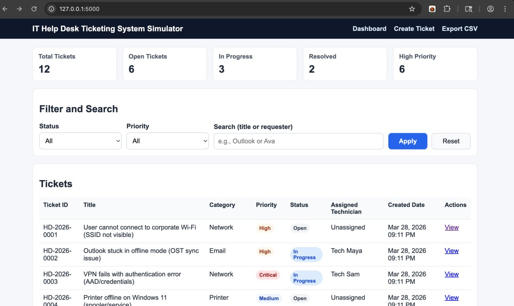
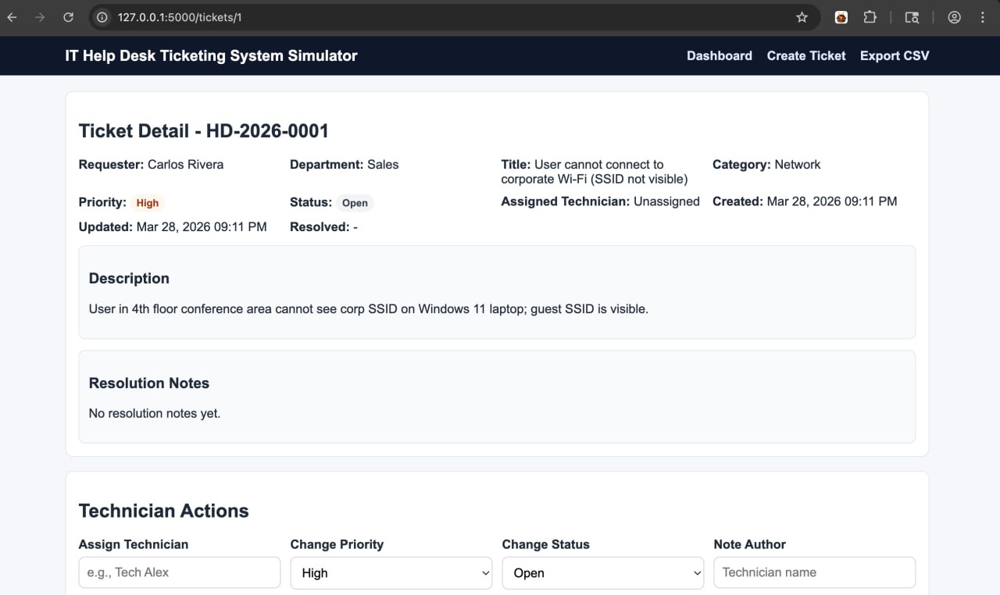
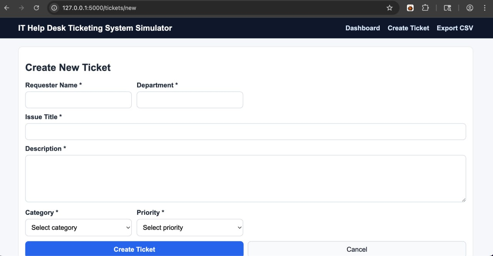

# IT Help Desk Ticketing System Simulator

A production-quality, beginner-friendly Help Desk web application built for portfolio demonstration of entry-level IT Support skills.

---

## Project Overview

This project simulates a real IT Help Desk workflow from ticket creation to closure. It includes user-side ticket submission, technician actions, status transitions, notes history, and dashboard metrics used to track support operations.

The app is designed to be easy to run locally and easy to explain in interviews.

---

## Features

### 1) Ticket Creation (User Side)
- Create tickets with:
  - `requester_name`
  - `department`
  - `issue_title`
  - `description`
  - `category` (Hardware, Software, Network, Account Access, Email, Printer, Security)
  - `priority` (Low, Medium, High, Critical)
- Auto-generated ticket ID (format: `HD-YYYY-0001`)
- Default status: **Open**
- Automatic `created_at` timestamp

### 2) Ticket Dashboard
- Table view showing:
  - Ticket ID
  - Title
  - Category
  - Priority
  - Status
  - Assigned Technician
  - Created Date
- Filter by status and priority
- Search by ticket title or requester

### 3) Ticket Detail Page
- Full ticket details
- Timestamps: created, updated, resolved
- Technician notes history (append-only)
- Audit log of ticket actions

### 4) Technician Actions
- Assign ticket to technician
- Change priority
- Change status with controlled lifecycle:
  - Open → In Progress → Resolved → Closed
- Add internal notes (appended)
- Add resolution notes
- Auto-set `resolved_at` when status becomes Resolved

### 5) Dashboard Metrics
- Total tickets
- Open tickets
- In Progress tickets
- Resolved tickets
- High priority tickets (High + Critical)

### 6) Data Persistence + Seed Data
- SQLite database
- Auto schema creation on first run
- 10 realistic sample IT tickets preloaded

### Bonus
- CSV export of all tickets
- Audit log table for ticket update traceability

---

## Tech Stack

- **Backend:** Python + Flask
- **Database:** SQLite
- **Frontend:** HTML, CSS, JavaScript (vanilla)

No frontend frameworks used (intentionally simple and interview-friendly).

---

## Project Structure

```text
helpdesk-ticketing-system/
├── app.py
├── requirements.txt
├── README.md
├── database/
├── templates/
├── static/
└── docs/
    ├── screenshots/
    └── workflow.md
```

---

## How to Run (Step-by-Step)

### 1) Clone repository
```bash
git clone <your-repo-url>
cd helpdesk-ticketing-system
```

### 2) Create virtual environment
```bash
python3 -m venv .venv
source .venv/bin/activate  # macOS/Linux
```

### 3) Install dependencies
```bash
pip install -r requirements.txt
```

### 4) Start app
```bash
python app.py
```

### 5) Open in browser
```text
http://127.0.0.1:5000
```

On first run, the app automatically creates the SQLite database and seeds sample tickets.

---

## Screenshots (Placeholders)

Placeholder files are included in `docs/screenshots/`:

- `dashboard-overview.png`
- `ticket-detail.png`
- `create-ticket-form.png`

Replace them with real screenshots and keep the same filenames for clean README rendering.

Example markdown:

```md



```

---

## Sample Tickets Included

The database seeds 10 realistic tickets such as:
- Wi-Fi not connecting
- Outlook not syncing
- Password reset request
- Printer offline
- VPN connection failure
- Slow computer performance
- Software installation request

These help you demo triage logic, ticket lifecycle updates, and support documentation.

---

## What this Project Demonstrates (Help Desk Skills)

- Incident intake and categorization
- Prioritization and workflow control
- Troubleshooting documentation via internal notes
- Resolution documentation and closure discipline
- Basic reporting/metrics and operational visibility
- Data handling and persistence using SQLite

---

## Interview Talking Points (STAR Method)

### 1) Structured Ticket Lifecycle
**Situation:** Entry-level help desk candidates need to show process discipline, not just technical fixes.  
**Task:** Build a realistic ticket workflow system with proper status management.  
**Action:** Implemented controlled status transitions, technician assignment, notes history, and resolution timestamps.  
**Result:** Produced a demo-ready app that mirrors real support operations and highlights procedural IT maturity.

### 2) Operational Visibility Through Metrics
**Situation:** Help desk teams must monitor workload and priority backlog.  
**Task:** Provide quick visibility into ticket queue health.  
**Action:** Added dashboard metrics for total/open/in-progress/resolved/high-priority tickets with filters and search.  
**Result:** Enables fast triage discussions and shows understanding of support KPIs.

### 3) Documentation and Traceability
**Situation:** Interviewers often ask how you document troubleshooting work.  
**Task:** Show traceable updates and communication-ready logs.  
**Action:** Implemented append-only technician notes, resolution notes, and audit logs for ticket updates; added workflow documentation.  
**Result:** Demonstrates strong documentation habits and accountability expected in real IT support roles.

---

## Workflow Documentation

See: [`docs/workflow.md`](docs/workflow.md)

Includes:
- ticket lifecycle explanation
- troubleshooting scenario walkthrough
- how this simulates real IT support operations

---

## Notes

- This project is intentionally simple and clear.
- It focuses on realism and support workflow clarity over advanced architecture.
- Safe for local portfolio demos.
